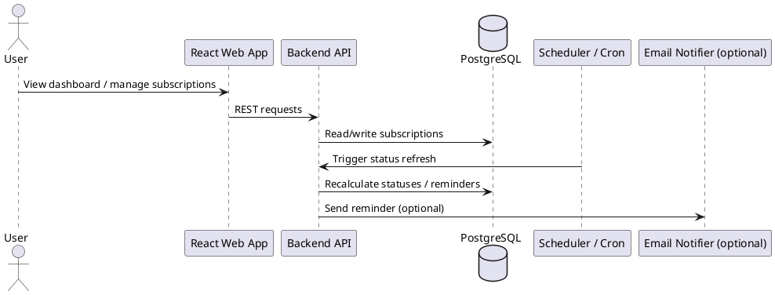
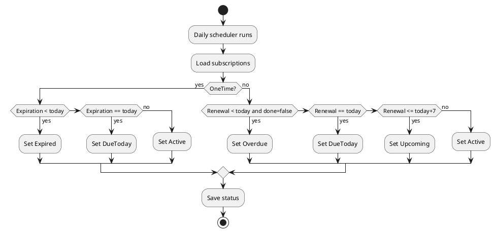

# SPEC-1-Subscription Tracker Web App

## Background

Many people track subscriptions in spreadsheets, but spreadsheets are weak at proactive reminders, consistent status rules, filtering, and CRUD workflows. This app converts a row-based spreadsheet into a simple web application where each row becomes one subscription record. The goal is a practical React web app with a basic backend that helps users track recurring and one-time subscriptions, know what is due, and avoid missed renewals or accidental charges.

## Requirements

### Must have
- Import or manually create subscription records using these fields:
  - Service Name
  - USD
  - Amount
  - Date Paid
  - Renewal Cycle
  - Next Renewal Date
  - Expiration Date
  - Status/Alert
  - Done?
  - Remarks
- Show a dashboard with upcoming renewals, overdue items, expired items, and active items.
- Support full CRUD for subscriptions.
- Apply consistent status logic automatically instead of relying only on manual spreadsheet labels.
- Allow marking reminders/tasks as done.
- Support simple search, filter, and sort.
- Store remarks such as “Auto Renewal Cancel”.

### Should have
- Spreadsheet/CSV import and export.
- Simple reminder flow for upcoming renewals and overdue subscriptions.
- Basic summary totals by month and by status.
- Support both recurring subscriptions and one-time subscriptions.

### Could have
- Email reminders.
- Multi-currency support beyond USD and NPR display.
- User accounts with personal data isolation.
- Calendar view.
- Renewal history/audit trail.

### Won’t have in MVP
- Complex accounting features.
- Bank integrations.
- Team collaboration.
- Advanced budgeting and forecasting.
- Native mobile apps.

## Method

### App overview

A small web app with:
- React frontend for dashboard, forms, and tables.
- Basic backend API for subscription data and reminder processing.
- Relational database for storing subscriptions and optional reminder events.
- Scheduled job that recalculates statuses and generates reminders.

This should be easy to build with a standard React + REST API stack.

### Target users

- Individuals managing personal entertainment, software, cloud, and utility subscriptions.
- Freelancers or students who need simple renewal tracking.
- Small users migrating from spreadsheets who want alerts and better visibility.

### User problems this app solves

- Forgetting upcoming renewals.
- Missing expiration dates for one-time subscriptions.
- Difficulty seeing which services are overdue or active.
- Manual spreadsheet formulas causing inconsistent status labels.
- No simple dashboard for monthly subscription obligations.
- No easy CRUD workflow for updating subscription records.

### Core use cases

1. User imports spreadsheet rows into the app.
2. User creates a new subscription manually.
3. User edits payment dates, renewal cycle, or remarks.
4. User views dashboard summary of active, overdue, expired, and upcoming renewals.
5. User filters subscriptions by status, cycle, or date range.
6. User marks an alert/task as done.
7. User receives a reminder before the next renewal date.
8. User exports current subscription data back to CSV.

### High-level architecture



### Recommended MVP architecture

- Frontend: React web app (prefer Next.js App Router for a simple full-stack-friendly frontend shell)
- Backend: NestJS API
- Database: PostgreSQL
- ORM: Prisma ORM
- Scheduler: Daily cron job
- Auth: Optional in MVP; can start as single-user app

### Preferred tech stack

The stack should prioritize open-source tools or platforms with a meaningful free tier.

#### Frontend
- **Next.js (React)** for the web app UI.
  - Good fit for dashboard pages, forms, search/filter UI, and deployment simplicity.
  - Easy hosting on Vercel Hobby.
- **UI**: Tailwind CSS for fast MVP styling.
- **Tables/forms**: TanStack Table for data table features and React Hook Form + Zod for form handling and validation.

#### Backend
- **NestJS** for the API.
  - Better structure than Express for modules like `subscriptions`, `dashboard`, `imports`, and `reminders`.
  - Good fit for validation, scheduled jobs, and clear contractor handoff.
- **Validation**: `class-validator` and `class-transformer` or Zod at API boundaries.
- **Scheduler**: NestJS scheduler module or platform cron calling a protected API route.

#### Database
- **PostgreSQL** as the primary database.
- **Prisma ORM** for schema, migrations, and type-safe database access.
  - Prisma ORM is open-source and works well with NestJS and PostgreSQL.

#### File import/export
- **CSV import/export** first for spreadsheet compatibility.
- For Excel support later, add a lightweight parsing library only if needed.

#### Notifications
- **MVP**: in-app alerts only.
- **Later**: email reminders using a provider with a free tier.

### Open-source / free-tier-first tool choices

Preferred defaults:
- Next.js: open-source
- NestJS: open-source
- Prisma ORM: open-source
- PostgreSQL: open-source
- Tailwind CSS: open-source
- TanStack Table: open-source
- React Hook Form: open-source
- Zod: open-source

For hosted services, prefer free-tier platforms first and keep the app portable so it can move later.

### Hosting recommendations

#### Best low-cost MVP hosting setup
- **Frontend**: Vercel Hobby
- **Backend API**: Render, Railway, or a small VPS depending on desired simplicity
- **Database**: Neon Postgres free tier

#### Recommended default deployment
1. **Frontend on Vercel Hobby**
   - Good fit for Next.js deployment and preview deployments.
   - Free tier is strong for personal projects and MVPs.
2. **Backend on Render or Railway**
   - Easier for a long-running NestJS API than trying to force the whole backend into frontend hosting patterns.
   - Choose the provider with the best free allowance available at the time of deployment.
3. **Database on Neon**
   - Managed Postgres with a free plan and works well with Prisma.

#### Alternative single-platform leaning
- If the app is kept very small, some scheduled tasks can be triggered with Vercel Cron calling backend endpoints.
- Vercel cron jobs are available on all plans, but Hobby has a minimum interval of once per day with hourly precision, which is enough for this subscription tracker MVP.

#### Hosting notes for this app
- Daily status refresh is enough for MVP, so free-tier cron is acceptable.
- Keep reminder generation idempotent so cron reruns do not create duplicate alerts.
- Keep file import processing small and asynchronous if the data set grows.
- Store secrets in hosting platform environment variables.
- Use separate environments for local, staging, and production if possible.

### Main entities

#### 1. Subscription
Primary business record.

| Field | Type | Required | Notes |
|---|---|---:|---|
| id | UUID | Yes | Primary key |
| service_name | string | Yes | Example: Netflix |
| usd_amount | decimal(10,2) | No | Original USD amount |
| local_amount | decimal(12,2) | No | Example: NPR amount |
| currency_code | string | No | Default can be NPR for local amount |
| date_paid | date | No | Last paid date |
| renewal_cycle | enum | Yes | Monthly, Quarterly, Yearly, OneTime |
| next_renewal_date | date | No | Used for recurring subscriptions |
| expiration_date | date | No | Used for one-time subscriptions or access end |
| status | enum | Yes | Computed, optionally override-disabled |
| alert_state | enum | Yes | None, Upcoming, DueToday, Overdue, Expired |
| done | boolean | Yes | Default false; user action completed |
| remarks | text | No | Free text |
| created_at | timestamp | Yes | Audit |
| updated_at | timestamp | Yes | Audit |

#### 2. ReminderEvent (optional but useful)
Tracks reminders generated/sent.

| Field | Type | Required | Notes |
|---|---|---:|---|
| id | UUID | Yes | Primary key |
| subscription_id | UUID | Yes | FK to subscription |
| reminder_type | enum | Yes | Upcoming, DueToday, Overdue |
| scheduled_for | timestamp | Yes | When reminder should trigger |
| sent_at | timestamp | No | When reminder was sent |
| status | enum | Yes | Pending, Sent, Failed, Dismissed |
| created_at | timestamp | Yes | Audit |

### Field definitions based on spreadsheet

- **Service Name**: Name of the service or subscription.
- **USD**: Price in USD, optional if local amount is the primary tracked value.
- **Amount**: Local charged amount, such as NPR.
- **Date Paid**: Last payment date.
- **Renewal Cycle**: Frequency of renewal. Suggested enum values:
  - Monthly
  - Quarterly
  - Yearly
  - OneTime
- **Next Renewal Date**: Next billing date for recurring subscriptions.
- **Expiration Date**: End-of-access date for one-time or prepaid subscriptions.
- **Status/Alert**: System-generated status label shown to the user.
- **Done?**: Whether the user has handled the current alert/task.
- **Remarks**: Notes like cancellation status or provider comments.

### Status logic

Status should be derived by the backend daily and also recalculated on create/update.

#### Proposed status values
- Active
- Upcoming
- DueToday
- Overdue
- Expired
- Completed

#### Rules
1. If `done = true`, status can display as `Completed` for the current reminder cycle, but the subscription itself still remains active in the long term if it is recurring.
2. For `renewal_cycle = OneTime`:
   - If `expiration_date` is in the future, status = `Active`.
   - If `expiration_date` is today, status = `DueToday` or `ExpiresToday` internally, but MVP can map to `DueToday`.
   - If `expiration_date` is in the past, status = `Expired`.
3. For recurring subscriptions:
   - If `next_renewal_date` is more than 7 days away, status = `Active`.
   - If `next_renewal_date` is within the next 7 days, status = `Upcoming`.
   - If `next_renewal_date` is today, status = `DueToday`.
   - If `next_renewal_date` is in the past and `done = false`, status = `Overdue`.
4. If remarks indicate “Auto Renewal Cancel”, this does not change status by itself, but should be visible as a badge/note.

#### Pseudocode

```text
if renewal_cycle == OneTime:
  if expiration_date is null:
    status = Active
  else if expiration_date < today:
    status = Expired
  else if expiration_date == today:
    status = DueToday
  else:
    status = Active
else:
  if next_renewal_date is null:
    status = Active
  else if next_renewal_date < today and done == false:
    status = Overdue
  else if next_renewal_date == today:
    status = DueToday
  else if next_renewal_date <= today + 7 days:
    status = Upcoming
  else:
    status = Active
```

### Dashboard requirements

The dashboard should answer: what needs attention, what is upcoming, and what am I spending?

#### Dashboard widgets
- Summary cards:
  - Total subscriptions
  - Active
  - Upcoming
  - Overdue
  - Expired
- Upcoming renewals list (next 7 or 30 days)
- Overdue items list
- Recent additions/updates
- Monthly spend estimate
- Table view with quick filters

#### Filters
- Status
- Renewal cycle
- Done state
- Date range
- Search by service name

#### Sorting
- Next renewal date ascending
- Expiration date ascending
- Amount descending
- Recently updated

### CRUD features

#### Create
- Add new subscription manually.
- Validate required fields based on cycle type.
- Auto-calculate initial status.

#### Read
- List all subscriptions.
- View subscription detail.
- Search, sort, and filter.

#### Update
- Edit any field.
- Recompute status after save.
- Optionally provide quick action buttons:
  - Mark done
  - Snooze alert (future improvement)
  - Update payment date

#### Delete
- Soft delete preferred for audit safety, but hard delete is acceptable for MVP.

### Reminders and alerts flow

#### Basic reminder flow
1. Scheduler runs once daily.
2. Backend finds records where:
   - recurring subscription renews within 7 days,
   - recurring subscription is due today,
   - recurring subscription is overdue,
   - one-time subscription expires today or has expired.
3. Backend updates `status` and `alert_state`.
4. App dashboard highlights these records.
5. Optional: backend sends email notifications for qualifying alerts.
6. User marks alert/task as done.
7. For recurring subscriptions, after user records a payment, the user updates `date_paid` and `next_renewal_date`.

#### Flow diagram



## Implementation

### Suggested MVP build steps

1. Create the frontend app with Next.js and Tailwind CSS.
2. Create the backend API with NestJS modules:
   - `subscriptions`
   - `dashboard`
   - `imports`
   - `reminders`
3. Define Prisma schema for subscriptions and optional reminder events.
4. Connect Prisma to PostgreSQL and apply initial migrations.
5. Build REST API endpoints:
   - `GET /subscriptions`
   - `GET /subscriptions/:id`
   - `POST /subscriptions`
   - `PUT /subscriptions/:id`
   - `DELETE /subscriptions/:id`
   - `POST /subscriptions/import`
   - `GET /subscriptions/export`
   - `GET /dashboard/summary`
6. Implement status calculation service.
7. Add scheduled daily job for status refresh.
8. Build frontend pages:
   - Dashboard
   - Subscription list
   - Create/edit form
   - Import/export page
9. Add table filters and search.
10. Add quick actions for mark done and edit.
11. Deploy frontend, backend, and database on free-tier-friendly hosting.
12. Add optional email reminder support later.

### API payload example

```json
{
  "serviceName": "Netflix",
  "usdAmount": 7.99,
  "localAmount": 1150.56,
  "datePaid": "2025-12-27",
  "renewalCycle": "Monthly",
  "nextRenewalDate": "2026-01-27",
  "expirationDate": null,
  "done": false,
  "remarks": ""
}
```

### Validation rules

- `serviceName` required.
- `renewalCycle` required.
- For recurring cycles, `nextRenewalDate` should normally be present.
- For `OneTime`, `expirationDate` is recommended.
- Amount fields must be non-negative.
- `datePaid`, `nextRenewalDate`, and `expirationDate` must be valid dates.

## Milestones

### Milestone 1: Data foundation
- Database schema created
- CRUD API working
- Status calculation service working

### Milestone 2: Frontend MVP
- Dashboard page
- Subscription table with filters
- Create/edit/delete workflows

### Milestone 3: Spreadsheet workflow
- CSV import
- CSV export
- Basic validation and error handling

### Milestone 4: Alerts
- Daily scheduled status refresh
- In-app alert highlighting
- Optional email reminders

## Gathering Results

Success can be measured by:
- User can import spreadsheet data with minimal cleanup.
- User can identify overdue and upcoming subscriptions from the dashboard in under 10 seconds.
- Status values remain consistent after edits and daily recalculation.
- User can complete create/edit/update flows without using the spreadsheet anymore.
- No missed renewals caused by lack of visibility.

### MVP acceptance checklist
- Can manage at least 100+ subscriptions smoothly.
- Dashboard loads active/upcoming/overdue/expired counts correctly.
- Status logic works for recurring and one-time subscriptions.
- CSV import maps spreadsheet columns correctly.
- User can mark records done and update renewal information.

## MVP scope

The MVP should include:
- Single-user web app
- Next.js frontend
- NestJS backend API
- PostgreSQL database
- Prisma ORM and migrations
- Subscription CRUD
- Dashboard with status summaries
- CSV import/export
- Automatic status logic
- Daily in-app reminders/alerts
- Free-tier-friendly deployment setup

## Future improvements

- User authentication and multi-user support
- Shared household/team subscriptions
- Email and push notifications
- Calendar integration
- Automatic next renewal date calculation from payment updates
- Renewal/payment history log
- Currency conversion and exchange rate sync
- Subscription categories and tags
- Charts for monthly/yearly spend trends
- Auto-detect duplicate subscriptions during import
- Mobile-friendly PWA support

## Need Professional Help in Developing Your Architecture?

Please contact me at [sammuti.com](https://sammuti.com) :)

